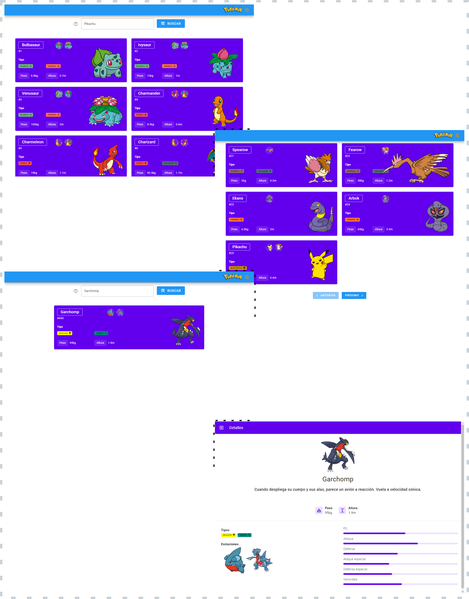

# Nuxt Pokemon

Project to show a list of pokemon, with the most relevant information of 
each pokemon, in the same way that they can be filtered, paginated and have a
viewer for each pokemon

### Used technology:

- [Nuxt](https://nuxt.com/)
- [Vue3](https://vuejs.org/)
- [Vuetify](https://vuetifyjs.com/en/)
- [PokeAPI](https://pokeapi.co/)
- [Axios](https://axios-http.com/)

## Requirements

- [Node.js](https://nodejs.org/) v16 or newer, [NPM](https://www.npmjs.com/) package manager

## Getting Started

1. Clone repository
```
$ git clone https://github.com/pedroriverove/nuxt-pokemon-frontend.git
```
2. Change into the working directory
```
$ cd nuxt-pokemon-frontend
```
3. Install project dependencies
```
$ npm install
```
4. Finally, launch the app
```
$ npm run dev
```

## Scripts

- `npm run dev` — Start the development server on http://localhost:3000
- `npm run build` — Build the application for production
- `npm run preview` — Locally preview production build

## Screenshot


